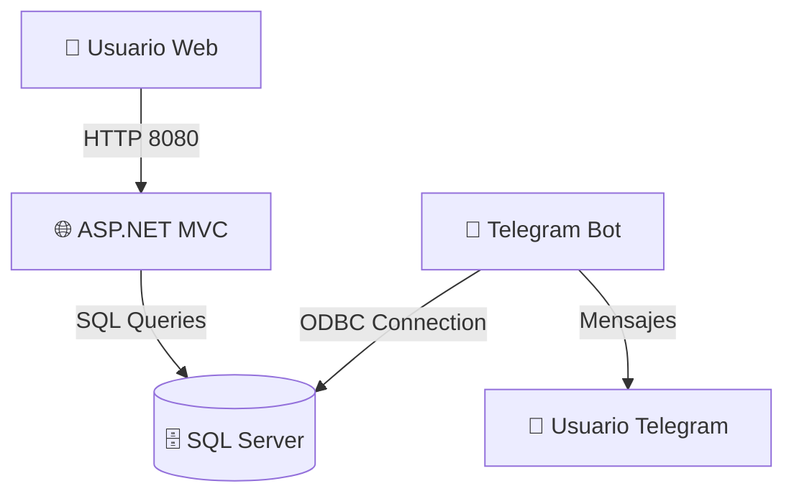

# 🧠 PACHO-DOCKER  
### Ecosistema de Inteligencia Fitopatológica en Contenedores Docker

[](https://docs.docker.com/compose/)
[](https://dotnet.microsoft.com/)
[](https://www.python.org/)
[](https://www.microsoft.com/sql-server/)
[](LICENSE)

---

## 📘 Descripción general

**PACHO-DOCKER** despliega un entorno completo para el ecosistema **PACHO Asistente**, un proyecto de inteligencia fitopatológica que integra:

- 🌐 Una **aplicación web ASP.NET MVC (BrainPacho)** para la gestion y administración de la red de expertos.  
- 🤖 Un **bot de Telegram en Python** conectado a la base de datos para el diagnostico y análisis de red neuronal en la deteccion de enfermedades.  
- 🗄️ Un **servidor SQL Server 2022** con persistencia local para el almacenamiento de tratamientos  e informacion de usuarios.  

Todo el stack está orquestado mediante **Docker Compose**, ofreciendo un entorno listo para desarrollo, pruebas o despliegue en producción.

---

## 🗂️ Estructura del proyecto

```
📦 pacho-docker/
 ┣ 📂 Pacho/                # Aplicación ASP.NET MVC (.NET 8.0)
 ┃ ┗ 📜 Dockerfile
 ┣ 📂 bot/                  # Bot de Telegram en Python
 ┃ ┗ 📜 Dockerfile
 ┣ 📜 docker-compose.yml    # Orquestador principal
 ┣ 📜 .env                  # Variables de entorno
 ┗ 📜 README.md             # Documentación del proyecto
```

---

## ⚙️ Servicios del stack

| Servicio | Descripción | Imagen base | Puerto |
|-----------|--------------|-------------|--------|
| 🧠 **web** | Aplicación ASP.NET MVC (BrainPacho) | `mcr.microsoft.com/dotnet/aspnet:8.0` | `8080:8080` |
| 🤖 **bot** | Bot de Telegram en Python | `python:3.11-slim` | — |
| 🗄️ **sqlserver** | Motor de base de datos SQL Server 2022 | `mcr.microsoft.com/mssql/server:2022-latest` | `1433:1433` |

---

## 🔑 Variables de entorno (`.env`)

Ejemplo de configuración del entorno (⚠️ reemplaza credenciales reales antes de subirlo a GitHub):

```ini
# Base de datos
SA_PASSWORD=__PasswordBD__
DB_NAME=_NombreBaseDatos

# Servidor de correo
MAIL_HOST=servidor.correo
MAIL_PORT=789
MAIL_USER=correo@gmail.com
MAIL_PASS=3dfg6frrr5678 (Contraseña de aplicación)
```

💡 Recomendado: crear un archivo `.env.example` sin contraseñas reales.

---

## 🚀 Guía rápida de despliegue

### 🧩 1. Clonar el proyecto

```bash
git clone https://github.com/tuusuario/pacho-docker.git
cd pacho-docker
```

### ⚙️ 2. Crear el archivo `.env`

```bash
cp .env.example .env
```
Edita los valores según tu entorno local o productivo.

### 🧱 3. Construir e iniciar los contenedores

```bash
docker compose up --build -d
```

Esto descargará las imágenes necesarias y levantará los servicios:
- `sqlserver`
- `web`
- `bot`

---

## 🌐 Acceso a los servicios

| Componente | URL / Conexión |
|-------------|----------------|
| 🌍 **Aplicación Web** | [http://localhost:8080](http://localhost:8080) |
| 🐘 **Base de datos SQL Server** | `localhost,1433` (user: `sa`, password: del .env) |
| 🤖 **Bot** | Se ejecuta automáticamente y se conecta vía API a Telegram |

---

## 📜 Comandos de administración

### 🔍 Ver estado de los servicios

```bash
docker compose ps
```

### 📋 Ver logs de un servicio

```bash
docker compose logs -f web
docker compose logs -f bot
```

### 🧰 Entrar al contenedor de SQL Server

```bash
docker compose exec sqlserver /opt/mssql-tools/bin/sqlcmd -S localhost -U sa -P "Pacho.25"
```

### 🧼 Detener y eliminar todo el entorno

```bash
docker compose down -v
```

### 🔁 Reconstruir desde cero

```bash
docker compose build --no-cache
docker compose up -d
```

---

## 🧠 Arquitectura general (Mermaid)



---

## 🧾 Descripción técnica

### 🧠 Web (ASP.NET MVC)
- Construido sobre .NET 8.0
- Usa `Entity Framework Core` con `SQL Server`
- Configuración de conexión inyectada desde `ConnectionStrings__DefaultConnection`
- Expone puerto 8080 para uso local o productivo

### 🤖 Bot (Python/Telegram)
- Basado en `python:3.11-slim`
- Usa:
  - `python-dotenv` para cargar variables de entorno
  - `pyodbc` para conectar con SQL Server
  - `telebot` o `python-telegram-bot` para la interacción con Telegram
- Crea o actualiza registros en la tabla `users_bot`

### 🗄️ SQL Server
- Versión 2022 (última estable)
- Credenciales configuradas en `.env`
- Volumen persistente `./sql_data` para datos

---

## 🧩 Persistencia de datos

Los datos del servidor SQL se almacenan localmente para evitar pérdida de información:

```yaml
volumes:
  - ./sql_data:/var/opt/mssql/data
```

Para limpiar todo (⚠️ elimina los datos guardados):

```bash
docker compose down -v
```

---

## 🧰 Resolución de problemas

| Error común | Causa probable | Solución |
|--------------|----------------|-----------|
| ❌ `Login failed for user 'sa'` | Contraseña incorrecta o cifrado SSL | Verifica `.env` y `TrustServerCertificate=True` |
| 🕓 `Connection timeout` | SQL Server aún no levantó | Espera 10-15s o revisa `depends_on` |
| 🧩 `pyodbc.InterfaceError` | Falta driver ODBC | Verifica que el bot instale `msodbcsql17` |
| ⚙️ `Port already in use` | Puerto 8080 ocupado | Modifica el mapeo en `docker-compose.yml` |

---

## 🧭 Flujo de desarrollo recomendado

```bash
# 1. Construir entorno
docker compose up --build -d

# 2. Revisar logs iniciales
docker compose logs -f

# 3. Acceder a la web
open http://localhost:8080

# 4. Testear bot
# (enviar mensaje a @PachoAsistenteBot en Telegram)

# 5. Apagar entorno
docker compose down
```

---

## 🧑‍💻 Créditos

**Autor:** Julian David Gonzalez - Karen Plazas Ramirez
**Proyecto:** PACHO-Asistente  
**Organización:** Universidad de Cundinamarca
**Correo:** [pachoasistente@gmail.com](mailto:pachoasistente@gmail.com)  
**Propósito:** Plataforma integral de diagnóstico y recomendación fitosanitaria en lechuga crespa.

---

## ⚖️ Licencia

Distribuido bajo licencia **MIT**.  
Consulta el archivo [LICENSE](LICENSE) para más información.
